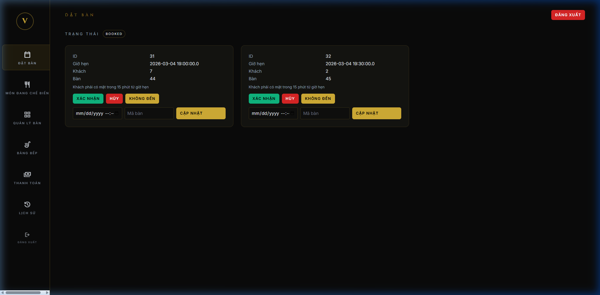
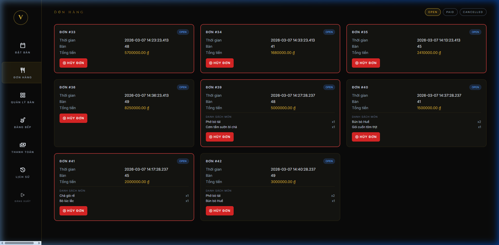
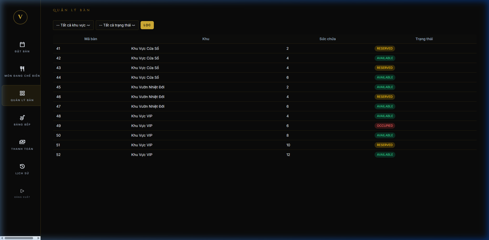
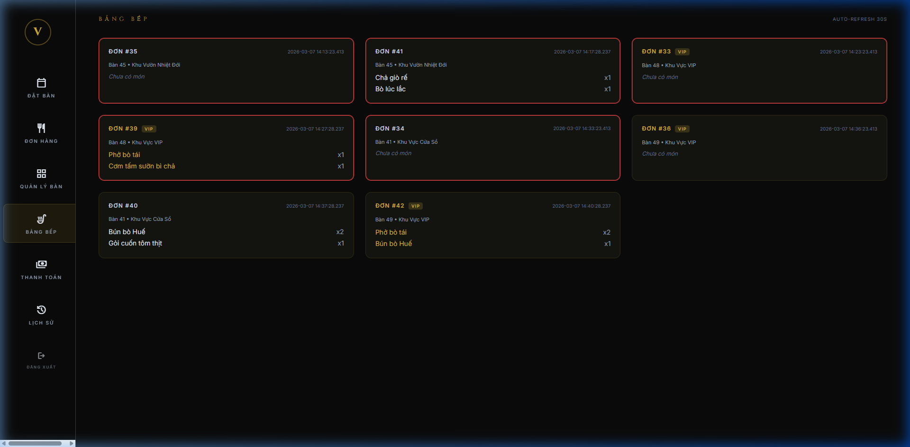
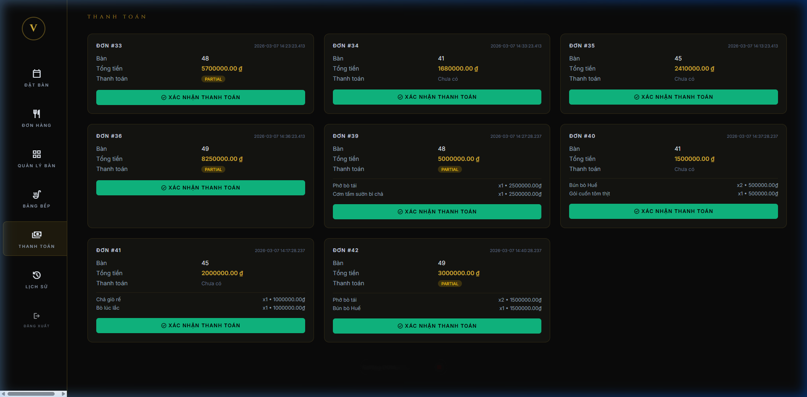
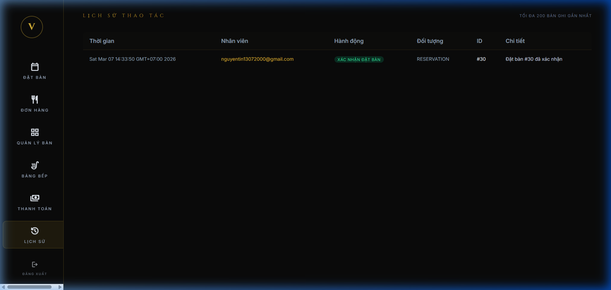

# Chức năng luồng Staff — Smart Restaurant

## Tổng quan

Staff có 6 trang chức năng, truy cập qua sidebar bên trái:

| # | Trang | URL | Trạng thái |
|---|---|---|---|
| 1 | Đặt bàn | `/staff/bookings` | ✅ Hoàn thành |
| 2 | Đơn hàng | `/staff/orders` | ✅ Hoàn thành |
| 3 | Quản lý bàn | `/staff/tables` | ✅ Hoàn thành |
| 4 | Bảng bếp | `/staff/kitchen-board` | ✅ Hoàn thành |
| 5 | Thanh toán | `/staff/payments` | ✅ Hoàn thành |
| 6 | Lịch sử thao tác | `/staff/action-log` | ✅ Hoàn thành |

---

## 1. Đặt bàn (`/staff/bookings`)



**Chức năng:**
- Xem danh sách đặt bàn theo trạng thái: `BOOKED`, `CONFIRMED`, `CANCELLED`, `NO_SHOW`
- **Xác nhận** đặt bàn → chuyển BOOKED → CONFIRMED
- **Hủy** đặt bàn với lý do → chuyển thành CANCELLED
- **Đánh dấu không đến** → NO_SHOW
- **Sửa** thời gian và bàn (có kiểm tra trùng lịch)
- Tự động đồng bộ trạng thái bàn khi xác nhận/hủy

**Kiến trúc:** `StaffBookingsController` → `BookingService` → `ReservationDAO` + `TableDAO`

---

## 2. Đơn hàng (`/staff/orders`)



**Chức năng:**
- Xem đơn hàng theo 3 tab: **OPEN** / **PAID** / **CANCELLED**
- Hiển thị chi tiết: mã đơn, bàn, thời gian, tổng tiền
- Hiển thị **danh sách món** trong mỗi đơn
- Nút **Hủy đơn** (chỉ với đơn OPEN)
- Đơn quá **10 phút** → viền đỏ cảnh báo
- Auto-refresh mỗi 30 giây

**Kiến trúc:** `StaffOrdersController` → `StaffOrderService` → `OrderDAO`

---

## 3. Quản lý bàn (`/staff/tables`)



**Chức năng:**
- Hiển thị tất cả bàn với trạng thái: `AVAILABLE`, `RESERVED`, `OCCUPIED`
- Lọc theo **khu vực** (VIP, Cửa Sổ, Vườn Nhiệt Đới...)
- Lọc theo **trạng thái**
- Hiển thị sức chứa từng bàn

**Kiến trúc:** `StaffTablesController` → `StaffTableService` → `TableDAO`

---

## 4. Bảng bếp (`/staff/kitchen-board`)



**Chức năng:**
- Hiển thị tất cả đơn **OPEN** kèm danh sách món
- Sắp xếp theo thời gian (cũ nhất trước → ưu tiên chế biến)
- Đơn bàn **VIP** → badge vàng + tên món chữ vàng
- Đơn quá **10 phút** → viền đỏ cảnh báo
- Auto-refresh mỗi 30 giây

**Kiến trúc:** `KitchenBoardController` → `KitchenBoardService` → `OrderDAO`

---

## 5. Thanh toán (`/staff/payments`)



**Chức năng:**
- Hiển thị tất cả đơn **OPEN** (chưa thanh toán)
- Hiển thị: bàn, tổng tiền, trạng thái payment (`PARTIAL`/`Chưa có`)
- Hiển thị chi tiết món + giá từng món
- Nút **Xác nhận thanh toán** → Order chuyển `PAID`, Payment chuyển `COMPLETED`
- Có xác nhận trước khi thanh toán (confirm dialog)

**Kiến trúc:** `StaffPaymentsController` → `StaffPaymentService` → `OrderDAO` + `PaymentDAO`

---

## 6. Lịch sử thao tác (`/staff/action-log`)



**Chức năng:**
- Ghi lại mọi thao tác của staff: xác nhận đặt bàn, hủy đặt bàn, hủy đơn, thanh toán...
- Hiển thị bảng: thời gian, nhân viên, hành động, đối tượng, ID, chi tiết
- Màu sắc phân biệt: xanh lá (xác nhận), đỏ (hủy), xanh dương (khác)
- Tối đa **200 bản ghi** gần nhất
- Lưu trong bộ nhớ (in-memory), mất khi restart server

**Kiến trúc:** `StaffActionLogController` → `StaffActionLog` (static in-memory storage)

---

## Kiến trúc tổng thể

```
Controller (nhận request HTTP)
    ↓
Service (xử lý logic nghiệp vụ)
    ↓
DAO (truy xuất database)
    ↓
Model (entity JPA)
```

### Files theo tầng

| Tầng | Files |
|---|---|
| **Controller** | `StaffBookingsController`, `StaffOrdersController`, `StaffTablesController`, `KitchenBoardController`, `StaffPaymentsController`, `StaffActionLogController` |
| **Service** | `BookingService`, `StaffOrderService`, `StaffTableService`, `KitchenBoardService`, `StaffPaymentService`, `StaffActionLog` |
| **DAO** | `ReservationDAO`, `OrderDAO`, `TableDAO`, `PaymentDAO` |
| **View (JSP)** | `bookings.jsp`, `orders.jsp`, `tables.jsp`, `kitchen-board.jsp`, `payments.jsp`, `action-log.jsp` |
